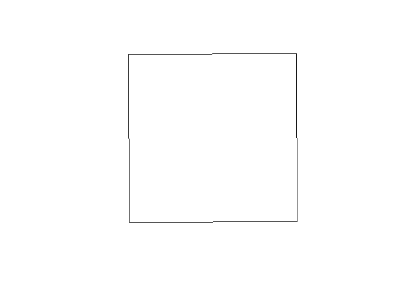
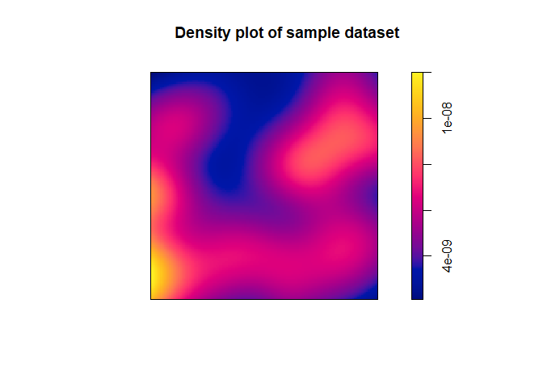
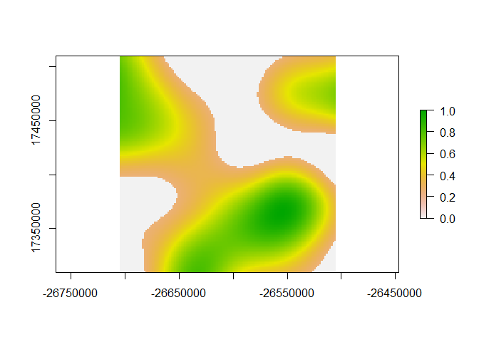
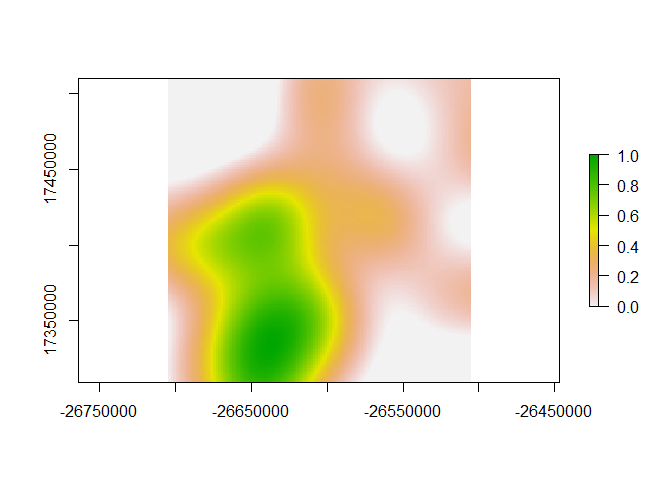
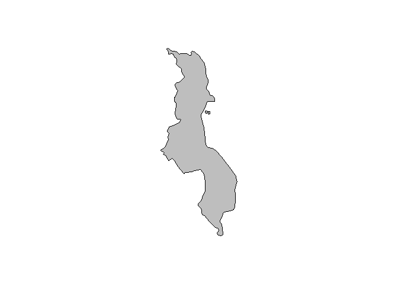
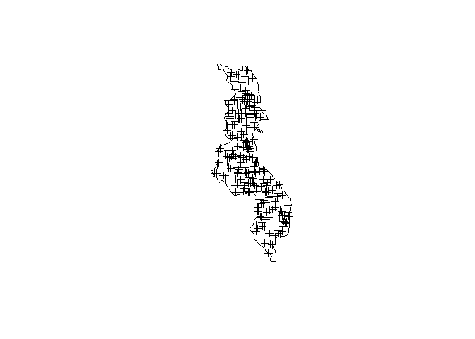
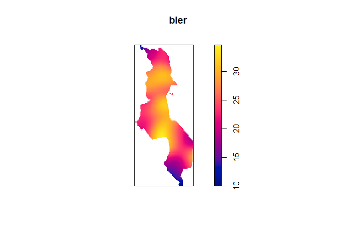
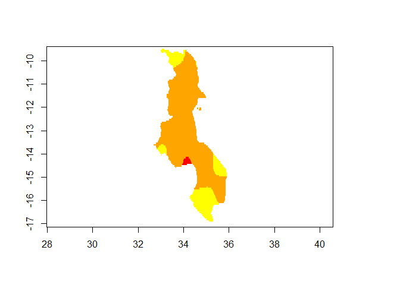

Simulated KDE
================
Anthony Caravaggi
10 November 2017

Libraries

``` r
library(maps)
library(mapdata)
library(maptools)
library(raster)
library(sp)
library(spatstat)
```

Create SpatialPolygon object of ~ 200 km^2.

``` r
poly_x <- c(-26705996, -26505997, -26505349,  -26705348, -26705996)
poly_y <- c(17509636, 17510283, 17310284, 17309637, 17509636)

poly_coords <- data.frame(poly_x, poly_y)
p <- Polygon(poly_coords)
ps <- Polygons(list(p),1)
sps <-  SpatialPolygons(list(ps))
plot(sps)
```



Generate 50 random points within the polygon and assign count values randomly drawn from a given distribution. Create a dataframe of point coordinates and count.

``` r
cams <- spsample(sps,n=50,type="random")
count <- round(runif(50, min=0, max=10))

detections <- data.frame(count, cams@coords)
head(detections)
```

    ##   count         x        y
    ## 1     8 -26628103 17352299
    ## 2     0 -26513505 17409815
    ## 3     3 -26554372 17467457
    ## 4     1 -26535916 17371097
    ## 5     3 -26548571 17352406
    ## 6     5 -26538241 17464423

Duplicate rows according to count values, preserving coordinate columns.

``` r
det.all <- detections[rep(row.names(detections), detections$count), 2:3]
head(det.all)
```

    ##             x        y
    ## 1   -26628103 17352299
    ## 1.1 -26628103 17352299
    ## 1.2 -26628103 17352299
    ## 1.3 -26628103 17352299
    ## 1.4 -26628103 17352299
    ## 1.5 -26628103 17352299

Create a point pattern dataset and apply the kernel density function. We'll get a duplication warning, but we're expecting that based on the previous step.

``` r
cam.ppd <- ppp(det.all$x, det.all$y, window = owin(c(-26705348, -26505349), c(17309637, 17509636)))
```

    ## Warning: data contain duplicated points

``` r
head(cam.ppd)
```

    ## Planar point pattern: 6 points
    ## window: rectangle = [-26705348, -26505349] x [17309637, 17509636] units

``` r
sp.dens <- density(cam.ppd)
plot(sp.dens, main = "Density plot of sample dataset")
```



We can then convert the density plot to a raster and apply thresholds for contextual visualisation. First, convert to raster.

``` r
sp.dens_r <- raster(sp.dens)
```

Rescale cell values between 0 and 1 using the following function.

``` r
rasterRescale<-function(r){
  ((r-cellStats(r,"min"))/(cellStats(r,"max")-cellStats(r,"min")))
}

sp.dens_r2 <- rasterRescale(sp.dens_r)
```

Apply threshold by setting values below a given value to 0.

``` r
sp.dens_r2[sp.dens_r2<=0.25]=0
plot(sp.dens_r2)
```



Rescale values between 0 and 1 to improve visualisation. The function, below, is similar to the one above, except it requires rmin and rmax to be specified. It makes sense for rmin = previous threshold and rmax = 1. Ensure minimum values are set to 0.

``` r
rasterRescale.Set<-function(r, rmin, rmax){
  ((r-rmin)/(rmax-rmin))
}

sp.dens_r3 <- rasterRescale.Set(sp.dens_r2, 0.26, 1)
sp.dens_r3[sp.dens_r3<=0]=0
plot(sp.dens_r3)
```



### KDEs within `map` objects

Objects from the `maps` package need to be converted to a SpatialPolygon prior to being coerced to a `owin` object as required by the `ppp` function. First, we're going to extract a map object. I'm choosing Malawi, because why not.

``` r
cmot <- map(database = 'world',
    regions = "malawi",
    fill = T,
    col = 'grey',
    resolution = 0,
    bg = 'white'
)
```



We then have to convert the map object to a SpatialPolygon. To do this, we extract the country name and use it as an identifer in the converstion, thus producing a continuous polygon.

``` r
IDs <- sapply(strsplit(cmot$names, ":"), function(x) x[1])
dib <- map2SpatialPolygons(cmot, IDs=IDs, proj4string=CRS("+proj=longlat +datum=WGS84"))
```

Then we generate our samples, as before.

``` r
pts <- spsample(dib,n=250,type="random")
plot(dib)
plot(pts, add = TRUE)
```



We create a dataframe containing the x and y coordinates of each point, as well as the number of individuals at each. My simulated data represent one individual per observation. If you have more than one observation per record, duplicate rows, as above.

``` r
detections <- data.frame(count = 1, pts@coords)
```

The `ppp` function requires an `owin` object to serve as the boundary for the KDE. You cannot pass a `map` object or converted map object to owin, directly, it has to be converted.

``` r
mass.owin <- as.owin.SpatialPolygons(dib)
```

Then we create the Point Pattern Process file and run the density function.

``` r
cam.ppd <- ppp(detections$x, detections$y, window = owin(mass.owin))
bler <- density(cam.ppd)
plot(bler)
```



We can use the rescale functions defined above to create specific bands across the KDE. First, convert the density plot to a raster and apply thresholds for contextual visualisation.

``` r
bler_r <- raster(bler)
```

Rescale cell values between 0 and 1.

``` r
rasterRescale<-function(r){
  ((r-cellStats(r,"min"))/(cellStats(r,"max")-cellStats(r,"min")))
}

bler_r2 <- rasterRescale(bler_r)
```

Apply threshold by setting values below a given value to 0. We want three different bands, 95%, 50% and 10%. For this, we need to set values below the given thresholds to 0

``` r
kde_95 <- bler_r2
kde_50 <- bler_r2
kde_10 <- bler_r2

kde_95[kde_95<0.95]=NA
kde_50[kde_50<0.50]=NA
kde_10[kde_10<0.10]=NA
plot(kde_10, col="yellow", legend=F)
plot(kde_50, col="orange", legend=F, add=T)
plot(kde_95, col="red", legend=F, add=T)
```


