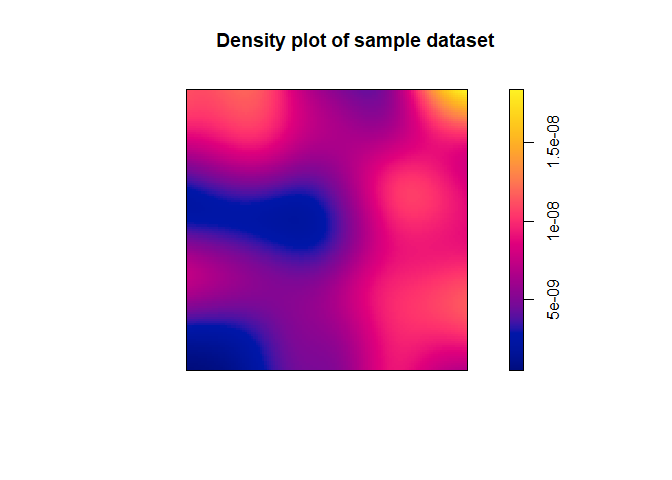
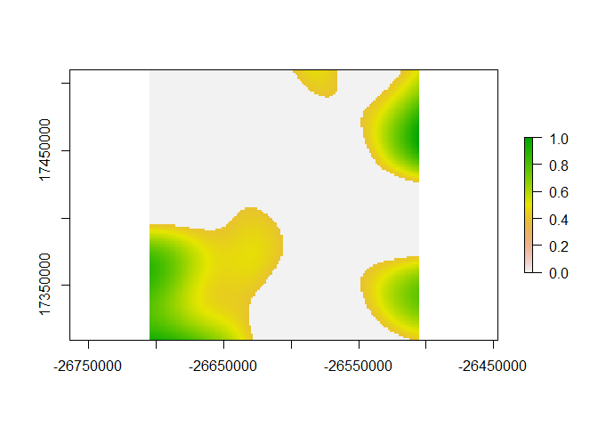
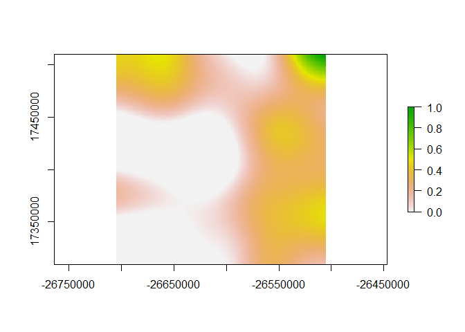

Simulated KDE
================
Anthony Caravaggi
10 November 2017

Libraries

``` r
library(sp)
library(spatstat)
```

    ## Warning: package 'spatstat' was built under R version 3.4.2

    ## Loading required package: nlme

    ## Loading required package: rpart

    ## 
    ## spatstat 1.52-1       (nickname: 'Apophenia') 
    ## For an introduction to spatstat, type 'beginner'

    ## 
    ## Note: spatstat version 1.52-1 is out of date by more than 12 weeks; a newer version should be available.

``` r
library(raster)
```

    ## 
    ## Attaching package: 'raster'

    ## The following objects are masked from 'package:spatstat':
    ## 
    ##     area, rotate, shift

    ## The following object is masked from 'package:nlme':
    ## 
    ##     getData

Create SpatialPolygon object of ~ 200 km^2. Generate 50 random points within the polygon and assign count values randomly drawn from a given distribution. Create a dataframe of point coordinates and count. Duplicate rows according to count values, preserving coordinate columns.

``` r
poly_x <- c(-26705996, -26505997, -26505349,  -26705348, -26705996)
poly_y <- c(17509636, 17510283, 17310284, 17309637, 17509636)

poly_coords <- data.frame(poly_x, poly_y)
p <- Polygon(poly_coords)
ps <- Polygons(list(p),1)
sps <-  SpatialPolygons(list(ps))

cams <- spsample(sps,n=50,type="random")
count <- round(runif(50, min=0, max=10))

detections <- data.frame(count, cams@coords)
det.all <- detections[rep(row.names(detections), detections$count), 2:3]
```

Create a point pattern dataset and apply kernel density function.

``` r
cam.ppd <- ppp(det.all$x, det.all$y, window = owin(c(-26705348, -26505349), c(17309637, 17509636)))
```

    ## Warning: data contain duplicated points

``` r
head(cam.ppd)
```

    ## Planar point pattern: 6 points
    ## window: rectangle = [-26705348, -26505349] x [17309637, 17509636] units

``` r
sp.dens <- density(cam.ppd)
plot(sp.dens, main = "Density plot of sample dataset")
```



We can then convert the density plot to a raster and apply thresholds for contextual visualisation. First, convert to raster.

``` r
sp.dens_r <- raster(sp.dens)
```

Rescale cell values between 0 and 1 using the following function.

``` r
rasterRescale<-function(r){
  ((r-cellStats(r,"min"))/(cellStats(r,"max")-cellStats(r,"min")))
}

sp.dens_r2 <- rasterRescale(sp.dens_r)
```

Apply threshold by formatting values below a given value to be 0.

``` r
sp.dens_r2[sp.dens_r2<=0.4]=0
plot(sp.dens_r2)
```



Rescale values between 0 and 1 to improve visualisation. The function, below, is similar to the one above, except it requires rmin and rmax to be specified. It makes sense for rmin = previous threshold and rmax = 1. Ensure minimum values are set to 0.

``` r
rasterRescale.Set<-function(r, rmin, rmax){
  ((r-rmin)/(rmax-rmin))
}

sp.dens_r3 <- rasterRescale.Set(sp.dens_r2, 0.41, 1)
sp.dens_r3[sp.dens_r3<=0]=0
plot(sp.dens_r3)
```



This raster can be overlaid on top of maps and/or other rasters, written to a file, etc.
