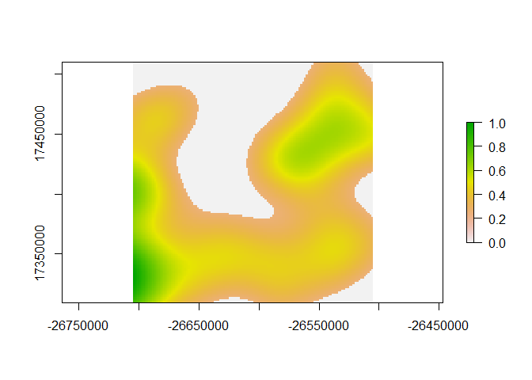
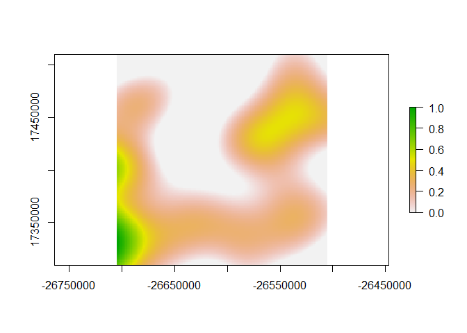

Simulated KDE
================
Anthony Caravaggi
10 November 2017

Libraries

``` r
library(sp)
library(spatstat)
library(raster)
```

Create SpatialPolygon object of ~ 200 km^2.

``` r
poly_x <- c(-26705996, -26505997, -26505349,  -26705348, -26705996)
poly_y <- c(17509636, 17510283, 17310284, 17309637, 17509636)

poly_coords <- data.frame(poly_x, poly_y)
p <- Polygon(poly_coords)
ps <- Polygons(list(p),1)
sps <-  SpatialPolygons(list(ps))
plot(sps)
```


Generate 50 random points within the polygon and assign count values randomly drawn from a given distribution. Create a dataframe of point coordinates and count.

``` r
cams <- spsample(sps,n=50,type="random")
count <- round(runif(50, min=0, max=10))

detections <- data.frame(count, cams@coords)
head(detections)
```

    ##   count         x        y
    ## 1     1 -26538520 17505737
    ## 2     6 -26510166 17372844
    ## 3     1 -26526684 17425644
    ## 4     8 -26611374 17358826
    ## 5     7 -26636938 17430074
    ## 6     6 -26609089 17340143

Duplicate rows according to count values, preserving coordinate columns.

``` r
det.all <- detections[rep(row.names(detections), detections$count), 2:3]
head(det.all)
```

    ##             x        y
    ## 1   -26538520 17505737
    ## 2   -26510166 17372844
    ## 2.1 -26510166 17372844
    ## 2.2 -26510166 17372844
    ## 2.3 -26510166 17372844
    ## 2.4 -26510166 17372844

Create a point pattern dataset and apply the kernel density function.

``` r
cam.ppd <- ppp(det.all$x, det.all$y, window = owin(c(-26705348, -26505349), c(17309637, 17509636)))
```

    ## Warning: data contain duplicated points

``` r
head(cam.ppd)
```

    ## Planar point pattern: 6 points
    ## window: rectangle = [-26705348, -26505349] x [17309637, 17509636] units

``` r
sp.dens <- density(cam.ppd)
plot(sp.dens, main = "Density plot of sample dataset")
```


We can then convert the density plot to a raster and apply thresholds for contextual visualisation. First, convert to raster.

``` r
sp.dens_r <- raster(sp.dens)
```

Rescale cell values between 0 and 1 using the following function.

``` r
rasterRescale<-function(r){
  ((r-cellStats(r,"min"))/(cellStats(r,"max")-cellStats(r,"min")))
}

sp.dens_r2 <- rasterRescale(sp.dens_r)
```

Apply threshold by formatting values below a given value to be 0.

``` r
sp.dens_r2[sp.dens_r2<=0.25]=0
plot(sp.dens_r2)
```



Rescale values between 0 and 1 to improve visualisation. The function, below, is similar to the one above, except it requires rmin and rmax to be specified. It makes sense for rmin = previous threshold and rmax = 1. Ensure minimum values are set to 0.

``` r
rasterRescale.Set<-function(r, rmin, rmax){
  ((r-rmin)/(rmax-rmin))
}

sp.dens_r3 <- rasterRescale.Set(sp.dens_r2, 0.26, 1)
sp.dens_r3[sp.dens_r3<=0]=0
plot(sp.dens_r3)
```


