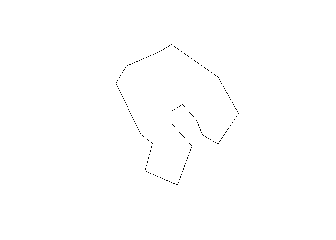
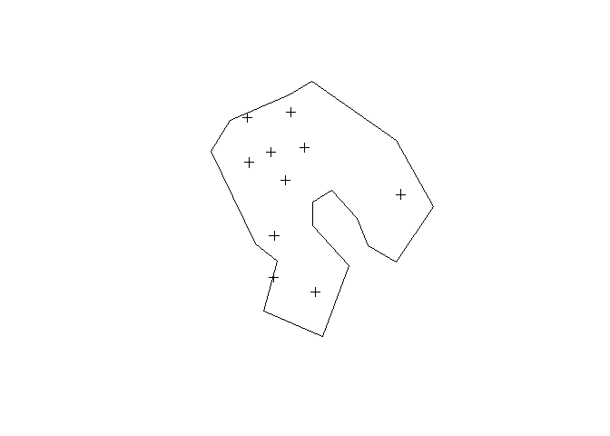
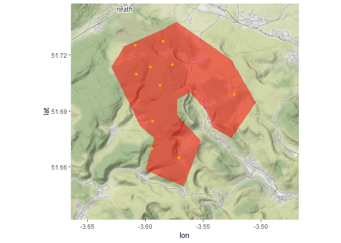

Generate Random Sampling Points by Minimum Distance
================
Anthony Caravaggi
2018-10-02

Libraries

``` r
devtools::install_github("dkahle/ggmap") # v2.7 required
library(ggmap)
library(spatstat)
library(rgdal)
library(rgeos)
library(raster)
library(maptools)
library(assertthat)
```

This demonstration will go through the generation of random points separated by a minimum distance threshold, step-by-step. A function, Rpoints, condensing the process can be found at the bottom of the page.

Create bounding polygon.

``` r
x <- c(-3.541238, -3.547341, -3.561397, -3.572132, -3.572495, -3.551687, -3.566528, -3.599789, -3.592162,
       -3.604156, -3.629145, -3.618190, -3.585571, -3.572779, -3.525398, -3.504483, -3.525454, -3.541238)
y <- c(51.68106, 51.69050, 51.7003, 51.69617, 51.68800, 51.67405, 51.64949, 51.65832, 51.67560,
       51.68177, 51.71373, 51.72463, 51.73346, 51.73788, 51.71745, 51.69461, 51.67548, 51.68106)
xy <- cbind(x,y)
p1 <- Polygon(xy)
poly <- SpatialPolygons(list(Polygons(list(p1), ID = "a")), proj4string=CRS("+proj=longlat +ellps=WGS84 +datum=WGS84 +no_defs"))
```



Generate random points with a minimum distance between each point. The rSSI function uses an inhibition distance based on a Simple Sequential Inhibition point process. I used it here for simplicity; other limited point-generation methods could be used instead.

``` r
samp1 <- rSSI(0.0025, 10, poly) 
samp1 <- cbind(samp1$x, samp1$y) # Extract coordinates
samp1 <- SpatialPoints(samp1, crs(poly)) # Transform to SpatialPoints shapefile
```



Check that the minumim threshold has not been violated.

``` r
spDists(samp1)*1000
```

    ##           [,1]      [,2]     [,3]     [,4]     [,5]     [,6]     [,7]
    ##  [1,]    0.000 1312.8340 4124.157 5157.040 1476.543 3592.447 2496.064
    ##  [2,] 1312.834    0.0000 5270.029 4845.761 1723.273 3223.120 1603.709
    ##  [3,] 4124.157 5270.0294    0.000 5867.207 5305.118 5144.840 6619.755
    ##  [4,] 5157.040 4845.7607 5867.207    0.000 6424.159 1623.806 6244.567
    ##  [5,] 1476.543 1723.2732 5305.118 6424.159    0.000 4809.765 1694.048
    ##  [6,] 3592.447 3223.1199 5144.840 1623.806 4809.765    0.000 4653.627
    ##  [7,] 2496.064 1603.7089 6619.755 6244.567 1694.048 4653.627    0.000
    ##  [8,] 2219.170  933.2195 5981.346 4542.367 2523.160 2978.460 1719.491
    ##  [9,] 5588.647 5666.2026 5014.428 1699.016 7012.371 2699.163 7213.111
    ## [10,] 1443.997 1216.7257 4475.104 3799.209 2626.947 2193.695 2815.484
    ##            [,8]     [,9]    [,10]
    ##  [1,] 2219.1695 5588.647 1443.997
    ##  [2,]  933.2195 5666.203 1216.726
    ##  [3,] 5981.3464 5014.428 4475.104
    ##  [4,] 4542.3670 1699.016 3799.209
    ##  [5,] 2523.1597 7012.371 2626.947
    ##  [6,] 2978.4596 2699.163 2193.695
    ##  [7,] 1719.4912 7213.111 2815.484
    ##  [8,]    0.0000 5613.604 1565.260
    ##  [9,] 5613.6039    0.000 4475.101
    ## [10,] 1565.2600 4475.101    0.000

    ##           [,1]      [,2]     [,3]     [,4]     [,5]     [,6]     [,7]
    ##  [1,]    0.000 1312.8340 4124.157 5157.040 1476.543 3592.447 2496.064
    ##  [2,] 1312.834    0.0000 5270.029 4845.761 1723.273 3223.120 1603.709
    ##  [3,] 4124.157 5270.0294    0.000 5867.207 5305.118 5144.840 6619.755
    ##  [4,] 5157.040 4845.7607 5867.207    0.000 6424.159 1623.806 6244.567
    ##  [5,] 1476.543 1723.2732 5305.118 6424.159    0.000 4809.765 1694.048
    ##  [6,] 3592.447 3223.1199 5144.840 1623.806 4809.765    0.000 4653.627
    ##  [7,] 2496.064 1603.7089 6619.755 6244.567 1694.048 4653.627    0.000
    ##  [8,] 2219.170  933.2195 5981.346 4542.367 2523.160 2978.460 1719.491
    ##  [9,] 5588.647 5666.2026 5014.428 1699.016 7012.371 2699.163 7213.111
    ## [10,] 1443.997 1216.7257 4475.104 3799.209 2626.947 2193.695 2815.484
    ##            [,8]     [,9]    [,10]
    ##  [1,] 2219.1695 5588.647 1443.997
    ##  [2,]  933.2195 5666.203 1216.726
    ##  [3,] 5981.3464 5014.428 4475.104
    ##  [4,] 4542.3670 1699.016 3799.209
    ##  [5,] 2523.1597 7012.371 2626.947
    ##  [6,] 2978.4596 2699.163 2193.695
    ##  [7,] 1719.4912 7213.111 2815.484
    ##  [8,]    0.0000 5613.604 1565.260
    ##  [9,] 5613.6039    0.000 4475.101
    ## [10,] 1565.2600 4475.101    0.000

Extract point coordinates and join to SpatialPoints object to create SpatialPointsDataFrame

``` r
df <- data.frame(x = samp1@coords[,1], y = samp1@coords[,2]) 
samp1 <- SpatialPointsDataFrame(samp1, df)
```

We might as well go ahead and map these to a Stamen Map image. This demonstration previously mapped on top of a Google Maps image but Google stopped providing free API access in July 2018. If you want to use this method wit Google Maps then you'll require an API key and to use the `get_googlemap` function. Create a bounding box, download map tiles image based the bounding box at a given resolution (zoom), and plot polygon and points.

``` r
bbx <- c(left=-3.664351,bottom=51.631480,right=-3.467390,top=51.747602)
tre <- get_stamenmap(bbx, zoom =12, maptype = "watercolor")
sDat <- data.frame(samp1@coords)
ggmap(tre) + geom_polygon(aes(x=x, y=y), data=poly, fill="red", alpha=.5) + 
  geom_point(aes(x = sDat[,1], y = sDat[,2]), data = sDat, col="orange")
```

    ## Source : http://tile.stamen.com/terrain/12/2006/1357.png

    ## Source : http://tile.stamen.com/terrain/12/2007/1357.png

    ## Source : http://tile.stamen.com/terrain/12/2008/1357.png

    ## Source : http://tile.stamen.com/terrain/12/2006/1358.png

    ## Source : http://tile.stamen.com/terrain/12/2007/1358.png

    ## Source : http://tile.stamen.com/terrain/12/2008/1358.png

    ## Source : http://tile.stamen.com/terrain/12/2006/1359.png

    ## Source : http://tile.stamen.com/terrain/12/2007/1359.png

    ## Source : http://tile.stamen.com/terrain/12/2008/1359.png



These steps - minus the mapping - have been condensed into one function, Rpoints, below. It includes an additional step - the extraction of the lowest non-zero vaue from the distance matrix, which is then added to the dataframe.

``` r
# Function to generate random points within a polygon buffered by a minimum distance
# Attaches a dataframe of distances-between-points
#
# d = inherited distance (see rSSI documentation)
# n = number of points
# p = polygon
#
# E.g.
# spat <- Rpoints(d = 0.05, n = 50, p = poly1)
Rpoints <- function(d = 0.0025, n = 10, p){
  s <- rSSI(d, n, p) 
  y <- SpatialPoints(cbind(s$x, s$y), crs(p))
  t <- data.frame(spDists(y)*1000)
  d <- data.frame(dist = apply(t, 1, function (v) min(v[v > 0])), # Collapse distances to non-zero minimum
                   x = y@coords[,1],
                   y = y@coords[,2])
  o <- SpatialPointsDataFrame(y,d)
}
spat <- Rpoints(d = 0.001, n = 30, p = poly)
head(spat@data)
```

    ##       dist         x        y
    ## 1 511.2992 -3.570760 51.70442
    ## 2 503.2030 -3.568312 51.71536
    ## 3 613.0949 -3.525095 51.68807
    ## 4 988.0534 -3.574132 51.66083
    ## 5 979.3824 -3.548274 51.72158
    ## 6 613.0949 -3.525672 51.69357
