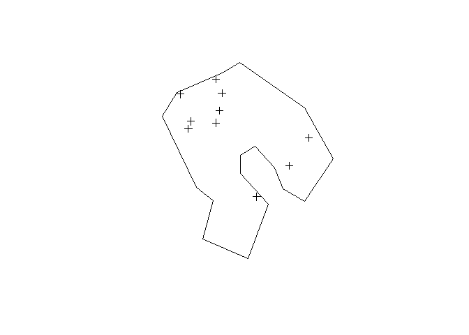
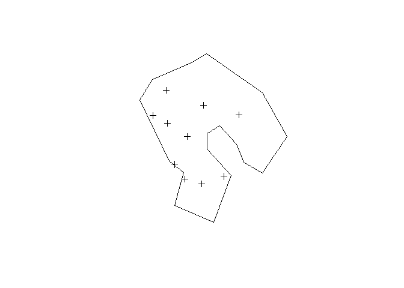
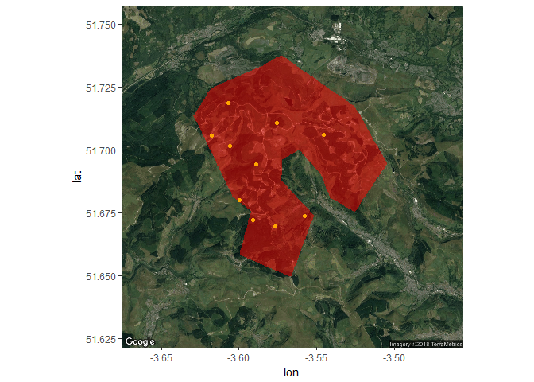

Generate Random Sampling Points by Minimum Distance
================
Anthony Caravaggi
2018-04-18

Generate Random Sampling Points by Minimum Distance
===================================================

Anthony Caravaggi 18 April 2018

Libraries

``` r
library(ggmap)
library(spatstat)
library(rgdal)
library(rgeos)
library(raster)
```

This demonstration will go through the generation of random points separated by a minimum distance threshold, step-by-step. A function, Rpoints, condensing the process can be found at the bottom of the page.

Create bounding polygon.

``` r
x <- c(-3.541238, -3.547341, -3.561397, -3.572132, -3.572495, -3.551687, -3.566528, -3.599789, -3.592162,
       -3.604156, -3.629145, -3.618190, -3.585571, -3.572779, -3.525398, -3.504483, -3.525454, -3.541238)
y <- c(51.68106, 51.69050, 51.7003, 51.69617, 51.68800, 51.67405, 51.64949, 51.65832, 51.67560,
       51.68177, 51.71373, 51.72463, 51.73346, 51.73788, 51.71745, 51.69461, 51.67548, 51.68106)
xy <- cbind(x,y)
p1 <- Polygon(xy)
poly <- SpatialPolygons(list(Polygons(list(p1), ID = "a")), proj4string=CRS("+proj=longlat +ellps=WGS84 +datum=WGS84 +no_defs"))
```



Generate random points with a minimum distance between each point. The rSSI function uses an inhibition distance based on a Simple Sequential Inhibition point process. I used it here for simplicity; other limited point-generation methods could be used instead.

``` r
samp1 <- rSSI(0.0025, 10, poly) 
samp1 <- cbind(samp1$x, samp1$y) # Extract coordinates
samp1 <- SpatialPoints(samp1, crs(poly)) # Transform to SpatialPoints shapefile
```



Check that the minumim threshold has not been violated.

``` r
spDists(samp1)*1000
```

    ##           [,1]     [,2]     [,3]     [,4]     [,5]     [,6]      [,7]
    ##  [1,]    0.000 4908.893 4589.448 4746.113 3291.052 2157.120 4196.2545
    ##  [2,] 4908.893    0.000 1032.279 1037.670 2474.616 4430.114 3401.5118
    ##  [3,] 4589.448 1032.279    0.000 1951.644 2890.511 4587.302 4062.2590
    ##  [4,] 4746.113 1037.670 1951.644    0.000 1773.963 3828.135 2433.2525
    ##  [5,] 3291.052 2474.616 2890.511 1773.963    0.000 2055.654 1376.9240
    ##  [6,] 2157.120 4430.114 4587.302 3828.135 2055.654    0.000 2327.3456
    ##  [7,] 4196.255 3401.512 4062.259 2433.253 1376.924 2327.346    0.0000
    ##  [8,] 4497.553 5296.673 5856.525 4358.709 2977.634 2350.010 1932.9633
    ##  [9,] 3696.527 2303.152 1381.607 2971.641 3166.756 4314.069 4521.2486
    ## [10,] 5009.460 4146.131 4905.168 3123.179 2335.731 2979.806  961.6563
    ##           [,8]     [,9]     [,10]
    ##  [1,] 4497.553 3696.527 5009.4600
    ##  [2,] 5296.673 2303.152 4146.1307
    ##  [3,] 5856.525 1381.607 4905.1684
    ##  [4,] 4358.709 2971.641 3123.1789
    ##  [5,] 2977.634 3166.756 2335.7309
    ##  [6,] 2350.010 4314.069 2979.8059
    ##  [7,] 1932.963 4521.249  961.6563
    ##  [8,]    0.000 6063.341 1646.0830
    ##  [9,] 6063.341    0.000 5457.9449
    ## [10,] 1646.083 5457.945    0.0000

Extract point coordinates and join to SpatialPoints object to create SpatialPointsDataFrame

``` r
df <- data.frame(x = samp1@coords[,1], y = samp1@coords[,2]) 
samp1 <- SpatialPointsDataFrame(samp1, df)
head(samp1@data)
```

We might as well go ahead and map these to a Google Map image. Create a bounding box, download a Google Map image based on the centroid of the bounding box at a given resolution (zoom), and plot polygon and points.

``` r
bbx <- c(left=-3.664351,bottom=51.631480,right=-3.467390,top=51.747602)
tre <- get_googlemap(center = c(lon=mean(bbx[c(1,3)]), lat=mean(bbx[c(2,4)])),
                        zoom =12, maptype = "satellite")
sDat <- data.frame(samp1@coords)
ggmap(tre) + geom_polygon(aes(x=x, y=y), data=poly, fill="red", alpha=.5) + 
  geom_point(aes(x = sDat[,1], y = sDat[,2]), data = sDat, col="orange")
```

    ## Map from URL : http://maps.googleapis.com/maps/api/staticmap?center=51.689541,-3.56587&zoom=12&size=640x640&scale=2&maptype=satellite&sensor=false



These steps - minus the mapping - have been condensed into one function, Rpoints, below. It includes an additional step - the extraction of the lowest non-zero vaue from the distance matrix, which is then added to the dataframe.

``` r
# Function to generate random points within a polygon buffered by a minimum distance
# Attaches a dataframe of distances-between-points
#
# d = inherited distance (see rSSI documentation)
# n = number of points
# p = polygon
#
# E.g.
# spat <- Rpoints(d = 0.05, n = 50, p = poly1)
Rpoints <- function(d = 0.0025, n = 10, p){
  s <- rSSI(d, n, poly) 
  y <- SpatialPoints(cbind(s$x, s$y), crs(p))
  t <- data.frame(spDists(y)*1000)
  d <- data.frame(dist = apply(t, 1, function (v) min(v[v > 0])), # Collapse distances to non-zero minimum
                   x = y@coords[,1],
                   y = y@coords[,2])
  o <- SpatialPointsDataFrame(y,d)
}
```

``` r
spat <- Rpoints(d = 0.001, n = 30, p = poly)
```

    ##        dist         x        y
    ## 1 1881.7276 -3.534130 51.69075
    ## 2  448.1446 -3.592968 51.72342
    ## 3  801.0140 -3.613105 51.70234
    ## 4  845.0331 -3.568266 51.72133
    ## 5  713.5785 -3.506961 51.69509
    ## 6  370.1300 -3.594272 51.73109
